# Delyra

**Sales & Order Lifecycle Platform**

Delyra is a full-stack sales and order lifecycle platform that connects CRM, pricing, approvals, quotations, finance, order handover, tasks, audit history, and executive reporting in one role-aware workspace.

The included portfolio environment is demonstrated through the fictional **Northstar Projects Group**. All people, companies, commercial values, credentials, documents, and operational records in the demo are synthetic.

> **Current version:** 1.0.0  
> **Automated tests:** 66 passing across 10 test files  
> **Business timezone:** Asia/Dubai  
> **Database:** PostgreSQL

## Product overview

Delyra models the commercial lifecycle from the first enquiry through delivery coordination:

**Lead → Qualification → Design / Scope → Pricing → Approval → Quotation → Invoice / Deposit → Won → Order Handover → PO / ETA tracking**

The product is designed around operational ownership rather than a single generic CRM screen. Managers, Finance, Order Coordination, Sales, Design, and executive users see the work, actions, and data appropriate to their role.

## Core capabilities

- Lead capture, qualification, follow-up, conversion, and customer records.
- Retail and Project opportunity tracks with stage-aware workflow progression.
- Role-based access, scoped navigation, and dedicated operational dashboards.
- Structured pricing with protected cost, selling price, gross profit, and margin data.
- Finance and manager approval workflows with tasks, alerts, and deep links.
- Versioned customer quotations with payment calendars and browser Print / Save as PDF.
- Invoice and configurable deposit confirmation before an opportunity can move to Won.
- Order Coordination handover with supplier reference, ERP purchase-order reference, delivery ETA, and ETA history.
- Document upload, preview, version history, archive, restore, and workflow evidence.
- Internal chatter, mentions, operational tasks, due dates, blockers, and notification routing.
- Central activity history and governance-oriented Audit Center.
- Executive reporting for pipeline health, conversion, won value, workspace mix, and operating risk.

## Product tour

### Sales Manager dashboard

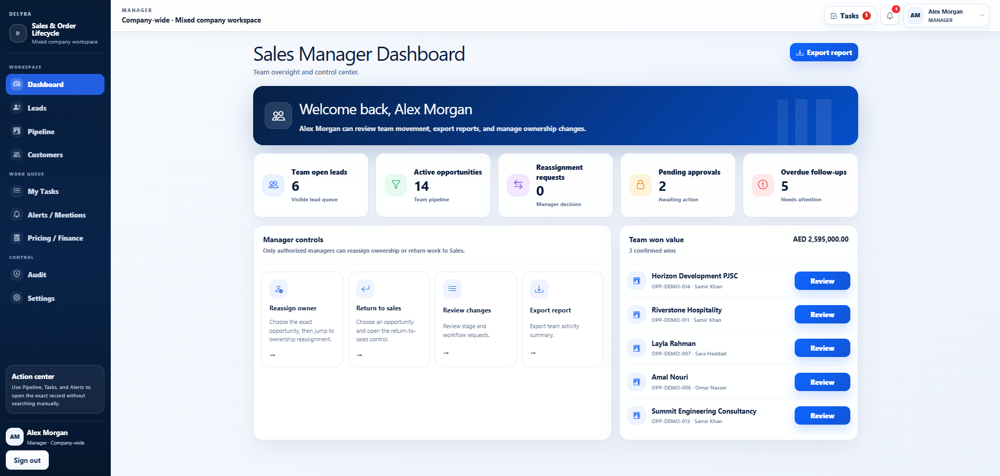

### Pipeline operating board

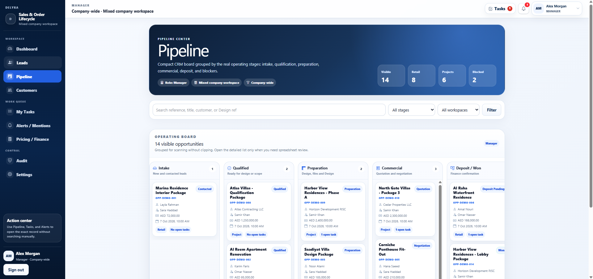

### Opportunity lifecycle workspace

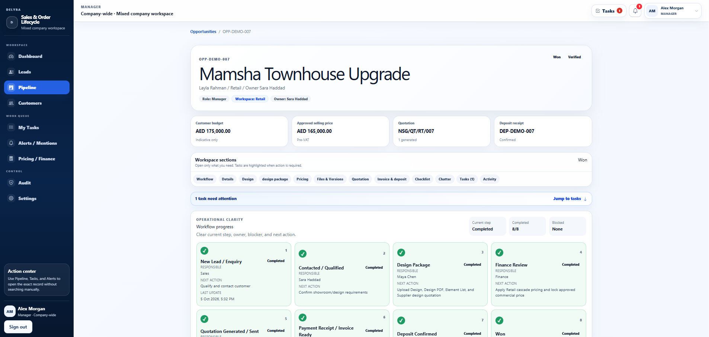

### Executive overview

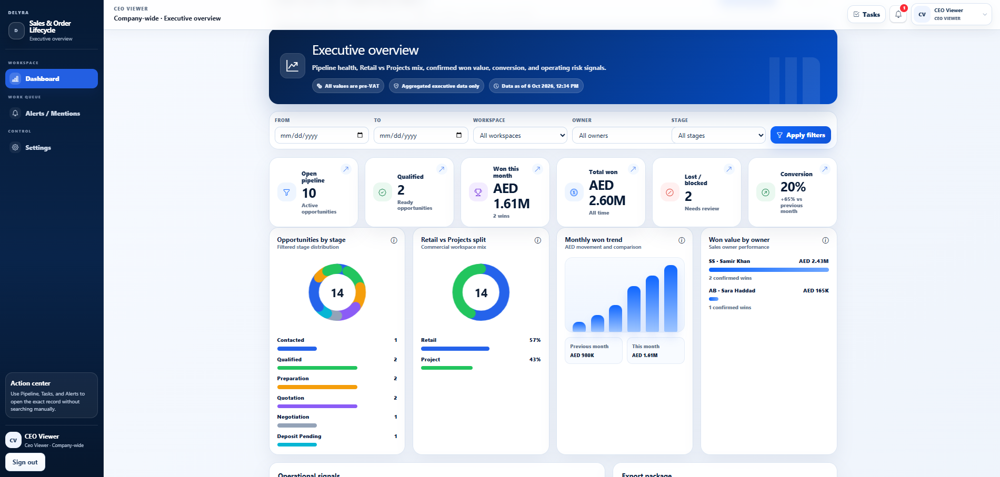

### Orders and handover workspace

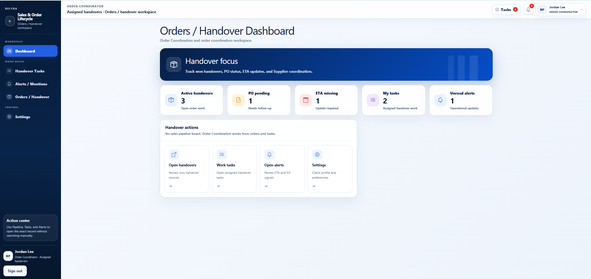

### Finance workspace

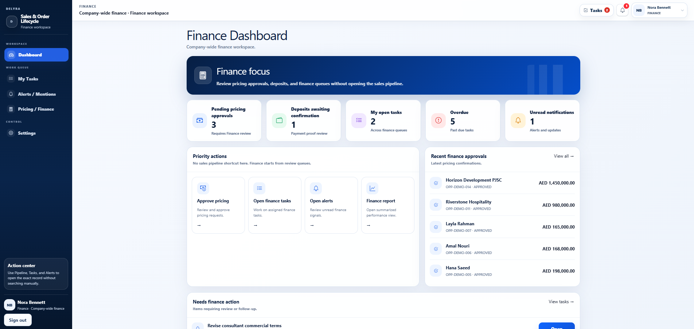

<details>
<summary><strong>View the complete 11-screen portfolio gallery</strong></summary>

### Leads workspace

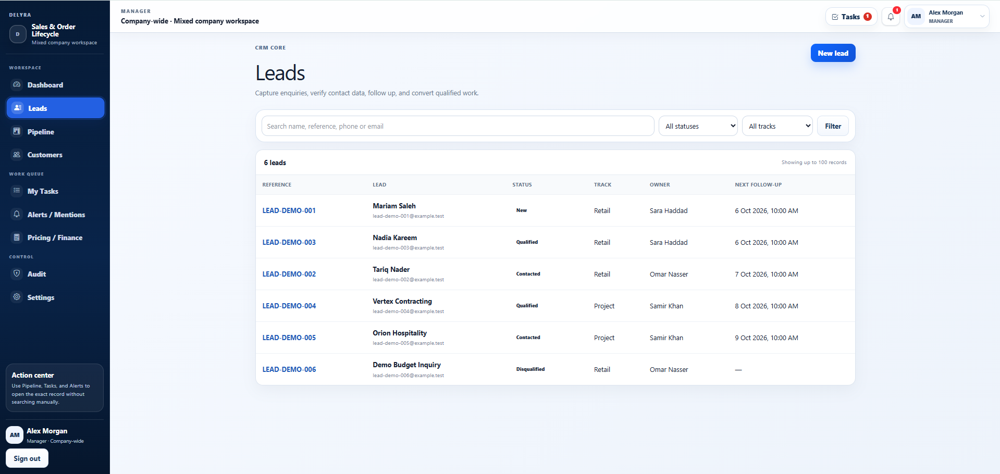

### Audit Center

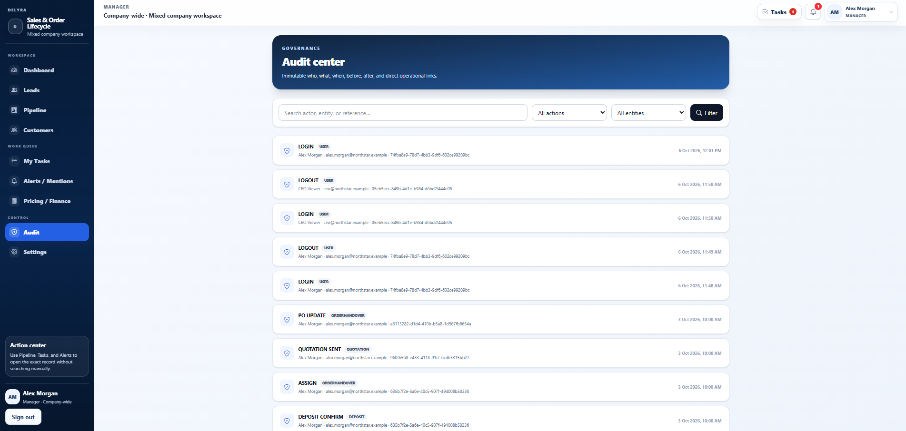

### Handover PO and ETA detail

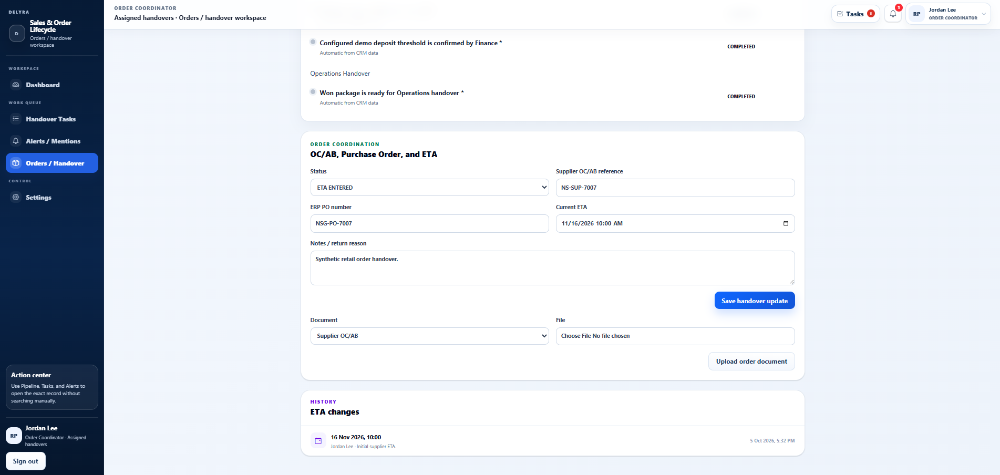

### Finance task queue

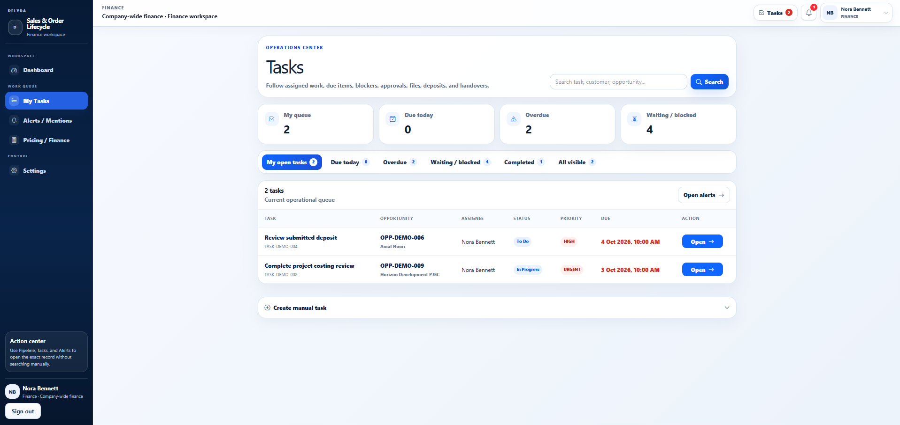

### Invoice and deposit workflow

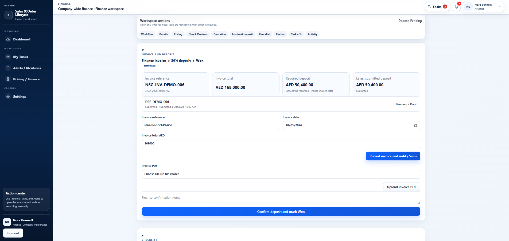

</details>

## Role-based experience

| Role | Primary experience |
| --- | --- |
| Manager | Company-wide pipeline oversight, approvals, reassignment, reporting, and governance |
| Finance | Pricing review, commercial approval, invoice and deposit confirmation, finance task queues |
| Order Coordinator | Won-order handover, supplier reference, ERP PO, delivery ETA, and coordination tasks |
| CEO Viewer | Aggregated executive metrics and company-wide performance overview |
| Sales / Project users | Scoped leads, opportunities, customer follow-up, quotation, and workflow ownership |
| Design users | Assigned design work, design-package evidence, files, and workflow completion |
| Admin | Users, roles, permissions, settings, and workflow configuration |

## Architecture

Delyra is implemented as a full-stack modular monolith using the Next.js App Router.

| Layer | Technology |
| --- | --- |
| Application | Next.js 16.3.8, React 19.2.7 |
| Language | TypeScript 6.0.3 |
| Database | PostgreSQL |
| ORM | Prisma 7.10.0 |
| Authentication | Server-side authentication with Argon2id password hashing |
| Validation | Zod |
| Financial arithmetic | Decimal.js |
| UI | Tailwind CSS and Bootstrap Icons |
| Testing | Vitest 4.1.9 |
| Local infrastructure | Docker Compose |

### Architectural decisions

- Financial values use decimal arithmetic rather than floating-point calculations.
- Pricing and margin visibility is permission-aware.
- Workflow transitions create operational tasks, notifications, activity records, and audit evidence.
- Order ETA input is interpreted in the `Asia/Dubai` business timezone while persisted timestamps remain suitable for server-side storage and comparison.
- Documents are accessed through a storage abstraction rather than directly from UI components.
- The included local storage driver is appropriate for local and portfolio environments. A production deployment should use durable object storage or a persistent volume for uploaded documents.
- Synthetic portfolio records are isolated from real customer or company information.

## Demo access

The portfolio dataset includes four primary accounts. All use the same synthetic demo password.

| Role | User | Email |
| --- | --- | --- |
| Manager | Alex Morgan | `alex.morgan@northstar.example` |
| Finance | Nora Bennett | `finance@northstar.example` |
| Order Coordinator | Jordan Lee | `jordan.lee@northstar.example` |
| CEO Viewer | CEO Viewer | `ceo@northstar.example` |

**Demo password:** `demo12345678`

The login screen also exposes these accounts through a collapsed **Demo access** section so a portfolio reviewer can discover the available roles without cluttering the default sign-in experience.

## Local setup

### Requirements

- Node.js `>=22.13.0`
- npm
- Docker Desktop or another Docker-compatible runtime

### 1. Install dependencies

```bash
npm install
```

### 2. Configure the environment

Copy `.env.example` to `.env` and configure the required values.

```bash
cp .env.example .env
```

Important environment groups include:

- application name, version, and URL
- PostgreSQL connection settings
- authentication secret and session policy
- login lockout policy
- storage driver and upload limits

### 3. Start PostgreSQL

```bash
docker compose up -d db
```

### 4. Apply the database migration and baseline seed

```bash
npm run db:generate
npm run db:deploy
npm run db:seed
```

### 5. Load the synthetic portfolio dataset

PowerShell:

```powershell
$env:PORTFOLIO_DEMO_PASSWORD = "demo12345678"
npx.cmd tsx .\prisma\demo-seed.ts
Remove-Item Env:PORTFOLIO_DEMO_PASSWORD
```

Bash:

```bash
PORTFOLIO_DEMO_PASSWORD=demo12345678 npx tsx prisma/demo-seed.ts
```

### 6. Start Delyra

Development:

```bash
npm run dev
```

Production-style local runtime:

```bash
npm run build
npm start
```

Default local endpoints:

- Application: `http://localhost:3000`
- Health endpoint: `http://localhost:3000/api/health`

## Quality gates

The v1.0.0 portfolio release was verified with:

- TypeScript compilation with no emit.
- ESLint.
- 10 Vitest files with **66 passing tests**.
- Successful optimized Next.js production build.
- Prisma migration status up to date.
- Production dependency audit with **0 critical, high, moderate, or low vulnerabilities** at the release gate.
- Public-source identity and secret scans.
- Synthetic-only screenshots and portfolio data.

Useful validation commands:

```bash
npx tsc --noEmit
npm test
npm run lint
npm run build
npm audit --omit=dev
npm run db:validate
```

## Operational utilities

The repository also includes scripts for:

- database backup and restore
- user password reset
- overdue-task escalation
- Prisma validation, generation, migration, deployment, and database reset

Run overdue task escalation with:

```bash
npm run tasks:escalate
```

## Deployment notes

A hosted deployment requires:

1. a PostgreSQL database accessible by the application
2. production environment variables and a strong `AUTH_SECRET`
3. `npm run db:deploy` during the release process
4. a durable storage strategy for uploaded files
5. HTTPS at the hosting layer

The current local storage adapter is intentionally kept behind a storage boundary so a hosted object-storage implementation can replace it without changing the business workflow.

### Live demo

[Delyra - Live Demo](https://delyra-sales-order-platform-production.up.railway.app)

The hosted portfolio environment runs on Railway with PostgreSQL, production migrations, synthetic Northstar demo data, HTTPS, and persistent application storage.

## Portfolio data and privacy

This public portfolio version contains no real company records, customer data, commercial pricing rules, credentials, uploaded business documents, or private repository history.

Northstar Projects Group, its users, customers, opportunities, quotations, invoices, deposits, supplier references, purchase orders, and financial values are fictional demonstration data created specifically for this portfolio release.

## Release

**Delyra 1.0.0** represents the completed portfolio baseline for the Sales & Order Lifecycle Platform.

The hosted demo is live. The remaining release step is the public GitHub `v1.0.0` release.
